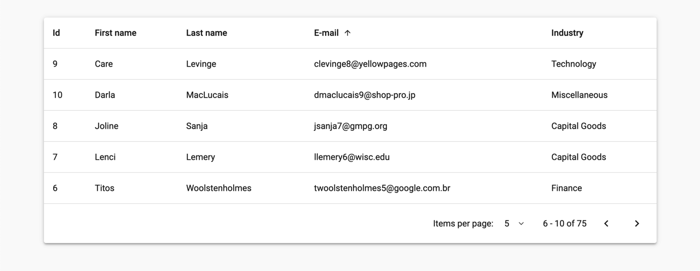

# DataGrid

Live demo: http://task-dg.likeadev.com

The DataGrid task project. Bootstrapped using Angular CLI. It includes the following features:

* sortable headers
* full-fledged pagination
* page size selection dropdown
* basic responsive support
* basic test coverage
* globally enabled OnPush change detection strategy
* prettifier
* style linter
* unused exports check
* husky pre-commit hooks

The **project strays away in a few places from the provided technical specification**. These changes were applied to make it functionally closer to a real-life data-grid component.

## Development server

Run `ng serve` for a dev server. Navigate to `http://localhost:4200/`. The app will automatically reload if you change any of the source files.

## Build

Run `ng build` to build the project. The build artifacts will be stored in the `dist/` directory.

## Running unit tests

Run `ng test` to execute the unit tests.
